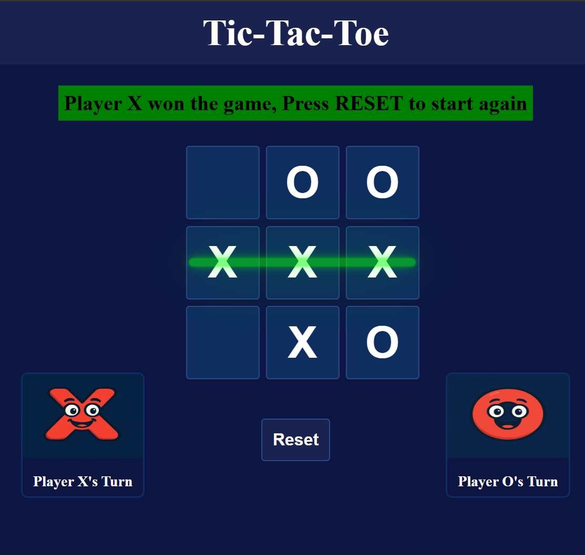

# 🧩 Tic-Tac-Toe Game

A modern and interactive **Tic-Tac-Toe** game built using **HTML, CSS, and JavaScript**.  
This project combines a fun cartoon aesthetic, glowing animations, and responsive design to deliver a smooth and visually engaging experience of the timeless classic.

---

## 🖼️ Game Preview

;

---

## 🎮 Features

✨ **Two-player mode** — alternate turns between Player X and Player O  
😄 **Cartoon-style avatars** — expressive characters representing each player  
💡 **Green glow turn indicator** — visually highlights whose turn it is  
🏆 **Winning line animation** — glowing line appears across the winning combo  
🧠 **Smart game logic** — automatically detects wins and draws  
🔁 **Reset button** — instantly start a new round  
📱 **Responsive design** — optimized for all screen sizes  

---

## 🧱 Tech Stack

| Technology | Role |
|-------------|------|
| **HTML5** | Game layout and structure |
| **CSS3** | Styling, glowing effects, and animations |
| **JavaScript (ES6)** | Core game logic and interactivity |

---

## ⚙️ How to Run Locally

Follow these simple steps to set up and play locally:

```bash
# 1. Clone the repository
git clone https://github.com/your-username/tic-tac-toe.git

# 2. Navigate into the project folder
cd tic-tac-toe

# 3. Run the game
# Simply open 'index.html' in your browser and start playing!
